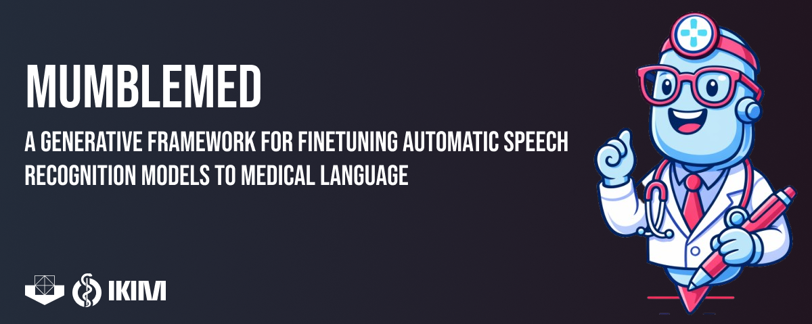

<p align="center">
  
</p>

<p align="center">
  
  
  
</p>

# MumbleMED

MumbleMED is a research pipeline for creating synthetic medical speech datasets for ASR fine-tuning. It starts with clinical language, either generated from terminology tables or read from existing report text, turns that language into speech with TTS, and writes audio paths and transcripts in a training-friendly format.

MumbleMED is developed by SHIP.AI at the Institute for Artificial Intelligence in Medicine (IKIM).

The repository is deliberately small. It does not contain patient audio, real speaker recordings, or official terminology exports. Instead, it ships with tiny public examples so that reviewers and new users can run the pipeline without private data. For real experiments, you bring your own licensed terminology tables, real report text if available, and optionally consented speaker reference clips.

The mental model is simple. Terminology and prompts define what should be said, TTS defines how it is spoken, and the splitter makes sure related samples do not leak across train, validation, and test. The result is a small lab bench for synthetic medical ASR data, with fewer mysteries than a full hospital data lake.

## Quick Start

You can install the project with `uv`:

```bash
git clone https://github.com/UMEssen/MumbleMED.git
cd MumbleMED
uv sync --group dev
```

After the environment is ready, run the public demo:

```bash
uv run mumblemed demo
```

The demo creates 10 samples from one bundled synthetic medical document and writes the generated files to these folders:

```text
examples/demo-output/audio/
examples/demo-output/csv/
```

By default, the demo audio is a quiet tone. That is intentionally boring: it lets the repository prove its file layout, CSV writing, and split generation without downloading a TTS model or handling voice samples. If you want the same demo with actual TTS audio, use the model's default voice:

```bash
uv run mumblemed demo --audio-mode tts --tts-language en
```

The demo is only a smoke test, so it should not be treated as an experimental dataset. For group-aware train, validation, and test splits, use the `llm` or `real` mode.

## A Small Pipeline Test

After the demo works, you can try a one-document run through the LLM/TTS path. The following example assumes a self-hosted OpenAI-compatible endpoint, and you should replace the model name and endpoint with your local setup:

```bash
uv run mumblemed --verbose llm \
  --local-llm \
  --num-docs 1 \
  --num-workers 1 \
  --model-name openai-compatible-model-id \
  --llm-endpoint http://127.0.0.1:8000/v1 \
  --dataset-path ./out/audio \
  --csv-path ./out/csvs \
  --coding-systems-path ./examples/coding-systems \
  --use-default-voice \
  --words-per-minute 80 \
  --tts-language en
```

Use `--local-llm` only for self-hosted endpoints that do not need an API key. For hosted APIs, omit that flag and provide `--llm-api-key` or `LLM_API_KEY`.

MumbleMED also works with commercial LLM APIs, including OpenAI itself, as long as the provider exposes an OpenAI-compatible Chat Completions API. A hosted run uses an API key and should not use `--local-llm`:

```bash
uv run mumblemed --verbose llm \
  --num-docs 1 \
  --num-workers 1 \
  --model-name gpt-4.1-mini \
  --llm-endpoint https://api.openai.com/v1 \
  --llm-api-key "$OPENAI_API_KEY" \
  --dataset-path ./out/audio \
  --csv-path ./out/csvs \
  --coding-systems-path ./examples/coding-systems \
  --use-default-voice \
  --words-per-minute 80 \
  --tts-language en
```

Hosted providers may process submitted terminology and generated text outside your local environment, and they may incur API costs. Use them only when that fits your study design and data governance requirements.

For German TTS, MumbleMED can use the Kartoffelbox patch on top of Chatterbox. You enable that path by setting the TTS language to German:

```bash
--tts-language de
```

You also need to provide the German checkpoint settings:

```bash
MODEL_REPO="SebastianBodza/Kartoffelbox-v0.1"
T3_CHECKPOINT="t3_cfg.safetensors"
HF_TOKEN="..."
```

## Modes

The `demo` mode is the fast sanity check. It creates a tiny local dataset from one bundled synthetic document. It is useful for testing installation and output layout, but it is not meant as an experimental dataset.

The `llm` mode is the fully synthetic path. It samples clinical terms, asks an LLM to write document-like medical text around them, normalizes the text for speech, and synthesizes the audio. This is the mode for controlled experiments where you want to steer vocabulary, document style, and clinical density.

The `real` mode is for cases where you already have report text. It reads a CSV with a `report_clear` column and turns those reports into synthetic speech. If the CSV also contains `patient_id`, MumbleMED keeps all documents from the same patient in the same split.

In all modes, the generated audio is synthetic. Reference voice clips, when used, condition the TTS voice; they are not copied into the output dataset.

## Voices And Pace

For public examples, quick checks, or repositories that should not ship voice samples, you can use the model's default voice:

```bash
--use-default-voice
```

For speaker-conditioned synthesis, place consented reference clips in a folder and point MumbleMED to that folder:

```bash
SPEAKER_VOICES_PATH="/path/to/voices"
```

If you use real speaker reference clips, it is best to record the same sentence, or at least a very similar sentence, for each speaker whenever possible. This helps the TTS model condition on comparable voice characteristics rather than on differences in wording, recording context, or speaking task.

Default-voice runs and speaker-conditioned runs are different experimental conditions, so they should be kept separate in your notes and reported separately.

You can also adjust the expected speaking rate that MumbleMED uses for chunking:

```bash
--words-per-minute 80
```

This does not force the TTS model to speak at exactly that tempo. It tells MumbleMED how much text should roughly fit into a 30-second sample before synthesis. Lower values create shorter chunks for slower, more deliberate speech. Higher values allow longer chunks for faster or more compressed dictation.

## Terminology And Prompts

The `llm` mode uses terminology tables as clinical vocabulary sources. Each terminology table should be a CSV file with two columns:

```text
display,code
```

This repository includes tiny placeholder tables so the synthetic pipeline can be tested without private terminology exports:

```text
examples/coding-systems/
```

Those files are only for testing, and you should replace them with your own licensed terminology exports before running a real experiment.

### Customizing Synthetic Documents

Terminology is only one lever. In the synthetic branch, users can adapt the prompts to describe almost any medically relevant content that should appear in the generated documents. This can include ICD or OPS codes, RadLex terms, TNM stages, tumor entities, medications, dosages, laboratory values, imaging findings, procedures, devices, complications, follow-up plans, negations, uncertainty phrases, and local abbreviations. In other words, if a concept is important for the ASR model to hear during fine-tuning, it can usually be introduced through the terminology tables, the prompt text, or both.

Prompts can also define the document type and structure before the text is sent to TTS. A discharge letter may be dense, long, and abbreviation-heavy. A radiology impression may be short, telegraphic, and full of measurements and negations. Oncology notes may need staging language, therapy lines, response assessment, and medication names. Emergency notes, operative reports, pathology descriptions, and outpatient follow-ups can each have their own rhythm, section structure, and level of clinical compression.

That flexibility is intentional. Synthetic ASR data is most useful when it resembles the documents and dictation style the model will later meet: local abbreviations, section headings, department-specific wording, uneven phrasing, and the small textual quirks that make clinical language scientifically interesting and computationally annoying. The goal is not to create one universal medical prompt, but to let users shape synthetic documents around their own clinical domain, terminology, and fine-tuning needs.

The default prompt templates live in `mumblemed/utils/llm.py`. Update `generate_synthetic_medical_text()` to change how terminology becomes clinical narratives. Update `process_text_structure()` to change how text is normalized before speech synthesis.

## Splits And Outputs

In `llm` mode, MumbleMED writes audio and metadata to separate locations. The audio files go to `--dataset-path`, and the CSV files go to `--csv-path`:

```text
audio files -> --dataset-path
CSV files   -> --csv-path
```

In `real` mode, MumbleMED creates a run folder under `--dataset-path`.

The CSVs contain transcript text, audio paths, speaker ids, durations, split information, and group identifiers. A small `stats.json` is written next to them so you can inspect the generated dataset before training.

Splits are group-aware. In `llm` mode, chunks from the same synthetic document/patient stay together. In `real` mode, splitting uses `patient_id` when that column exists; otherwise, each row is treated as its own document-level group. This avoids the common ASR leakage problem where chunks from the same clinical case quietly appear in both train and test. For reproducible split assignment, pass `--seed`.

## Useful Commands

You can validate the configuration without generating audio:

```bash
uv run mumblemed llm --dry-run --local-llm --use-default-voice
```

You can run the tests with:

```bash
uv run pytest tests/ -v
```

## Environment

Most settings can live in a local `.env` file. You can create one from the example file:

```bash
cp .env.example .env
```

A small self-hosted setup usually looks like this:

```bash
LLM_NAME="openai-compatible-model-id"
LLM_ENDPOINT="http://127.0.0.1:8000/v1"
LOCAL_LLM="true"
LLM_DATASET_PATH="./out/audio"
LLM_CSV_PATH="./out/csvs"
CODING_SYSTEMS_PATH="./examples/coding-systems"
USE_DEFAULT_TTS_VOICE="true"
TTS_LANGUAGE="en"
WORDS_PER_MINUTE="80"
```

Use `LOCAL_LLM=true` only for self-hosted endpoints. Hosted providers should use `LLM_API_KEY`.

For a hosted provider, keep `LOCAL_LLM` unset or set it to `false`, and provide the API token:

```bash
LLM_NAME="gpt-4.1-mini"
LLM_ENDPOINT="https://api.openai.com/v1"
LLM_API_KEY="..."
LOCAL_LLM="false"
```

## Warnings And Notes

MumbleMED is research software, not a clinical device. Generated text and audio can contain mistakes, hallucinated clinical details, strange phrasing, wrong abbreviations, or acoustic artifacts. You should treat every generated sample as raw synthetic data until it has been inspected and filtered.

The public examples in this repository are intentionally tiny and are only meant to make the pipeline runnable. They are not medical terminology resources, benchmark datasets, or evidence that a generated dataset is clinically valid.

If you use real report text, licensed terminology exports, hosted LLM APIs, or speaker reference clips, you are responsible for the relevant permissions, consent, privacy review, and data governance requirements. Hosted LLM providers may process submitted text outside your local environment, so do not send sensitive data to a provider unless that is explicitly allowed in your setting.

Synthetic speech should be evaluated before training or evaluation use. In particular, check whether the TTS output preserves the information that matters for your task, including clinical meaning, document structure, terminology, and local reporting conventions.

## License

MumbleMED is licensed under the MIT License. See [LICENSE](LICENSE) for the full license text.

## Manuscript

A current preprint is available at [JMIR Preprints](https://preprints.jmir.org/preprint/99797). We will replace this link as soon as there is an update in the review process or publication process, including a final manuscript, accepted manuscript, or version-of-record link. Until then, please treat the preprint as a non-final scholarly reference.
